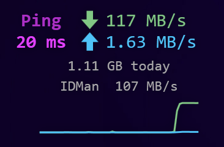
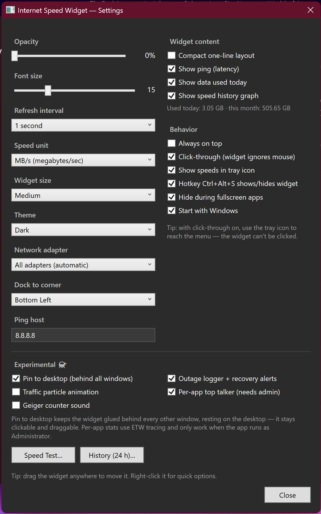

# Pulse

A lightweight desktop widget for Windows 11 that shows your **live internet
speed** — download ↓, upload ↑, and ping — in a small, transparent,
always-on-top card. It reads your network adapter's real throughput (not a
speed test), so it shows whatever your PC is actually sending and receiving.
An optional AIO mode adds live CPU, RAM, GPU, and Disk stats alongside it.



## Download

Grab the latest exe from **[Releases](https://github.com/uyarbekir-creator/Pulse/releases)**
— no installer, just run it. Windows SmartScreen may warn about an
unrecognized app (the exe isn't code-signed): click *More info → Run anyway*.

## Features

- Live ↓ / ↑ speeds, ping, and data used today / this month
- 24-hour history chart and an on-demand internet speed test
- Optional AIO system monitor: live CPU, RAM, GPU, and Disk stats in their
  own framed sections, off by default (Settings → System Monitor)
- Themes (Dark / Light / Black), compact one-line layout, font-size slider,
  background opacity down to fully transparent
- Drag anywhere, or dock to any screen corner
- System tray icon with live speed numbers; global hotkey `Ctrl+Alt+S`
- Auto-hides during fullscreen games, reappears after
- Start with Windows (works in both normal and admin modes)
- Units: Mbps, MB/s, or auto-scale

**Experimental extras** (Settings → Experimental, all off by default):
pin-to-desktop mode, click-through mode, traffic particle animation,
Geiger-counter sound, internet outage logger with recovery alerts, and a
per-app bandwidth top talker (needs admin — there's a one-click
*Restart as administrator* button).

## Settings

Right-click the widget or the tray icon → **Settings…**. Everything applies
instantly and is saved to `%APPDATA%\Pulse\`. Delete that
folder to reset.



## Build from source

Requires the .NET 8 SDK:

```powershell
dotnet build          # debug build
dotnet publish -c Release -r win-x64 --self-contained false -p:PublishSingleFile=true
```

---

*Made with [Claude Code](https://claude.com/claude-code)* 🤖
